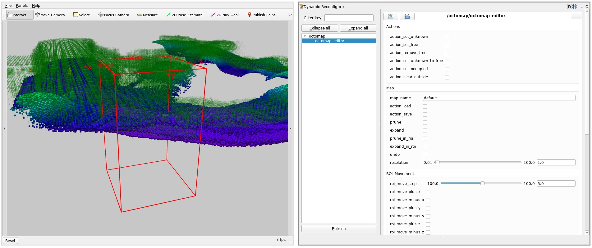

# MRS Octomap Tools

This package contains a set of tools for OctoMap manipulation and visualization.

## OctomapRvizVisualier

A publisher of RVIZ markers for OctoMap visualization.

## OctomapEditor

An editor for OctoMap. The editor uses RQT Reconfigure as a GUI tool and OctomapRvizVisualizer for real-time preview.
The editor provides adjustable bounding box to specify the region for operations.

Supported operations:
  * setting/unsetting free/occupied/unknown space within the bounding box and outside of a bounding box
  * changing of resolution of the octomap
  * creating free space above the ground level
  * expanding and pruning the tree and the bounding box region (mainly for testing)

